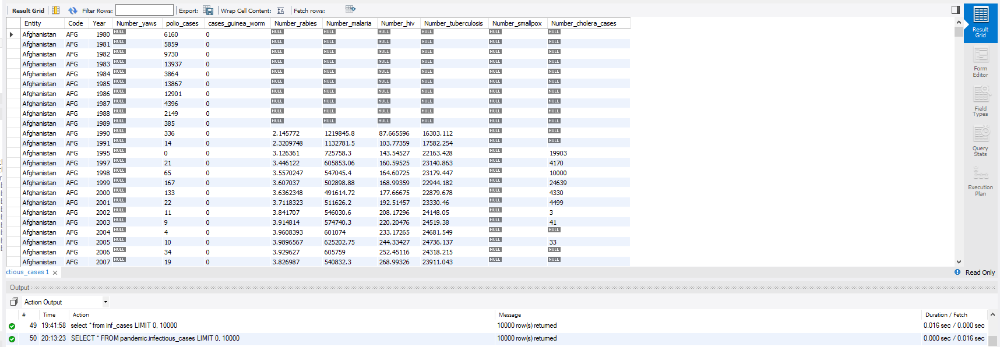
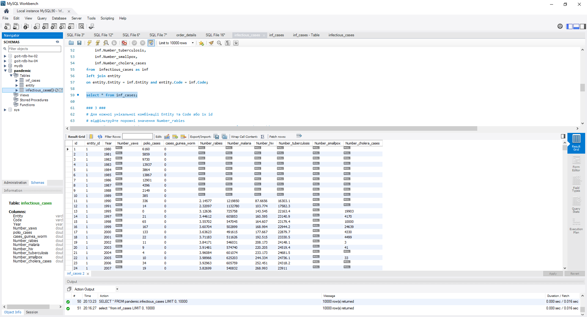
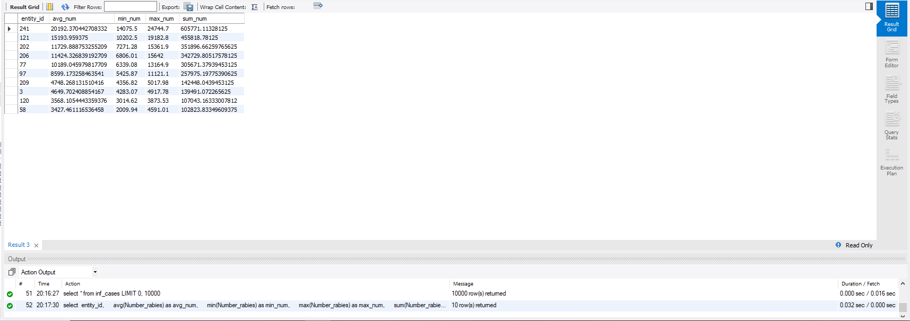
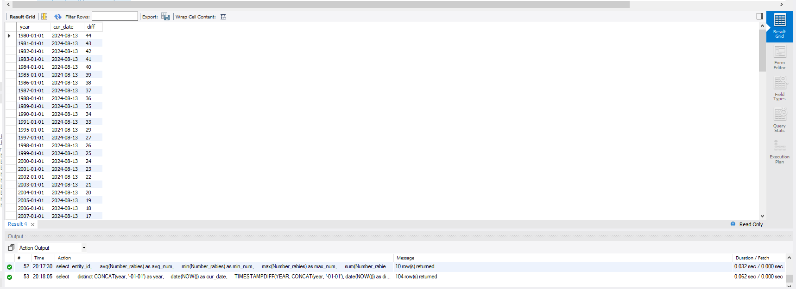
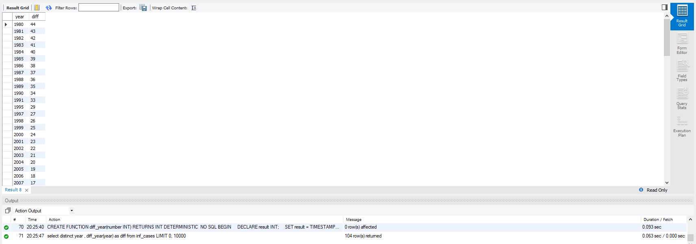

# Домашнє завдання до Теми 7. Додаткові вбудовані SQL функції. Робота з часом


## 1. Завантаження даних
```sql
Use pandemic;

select Count(entity) from infectious_cases;
```




## 2. Нормалізація таблиці `infectious_cases` до 3ї нормальної форми. 

```sql
create table entity (
    id INT AUTO_INCREMENT PRIMARY KEY,
    entity VARCHAR(255),
    code VARCHAR(10)
);

insert into entity (entity, code) 
select distinct entity, code from infectious_cases
order by entity;


drop table if exists  inf_cases;


create table inf_cases (
	id INT AUTO_INCREMENT PRIMARY KEY,
	entity_id INT,
	Year INT,
    Number_yaws INT,
    polio_cases FLOAT,
    cases_guinea_worm FLOAT,
    Number_rabies FLOAT,
    Number_malaria FLOAT,
    Number_hiv FLOAT,
    Number_tuberculosis FLOAT,
    Number_smallpox FLOAT,
    Number_cholera_cases FLOAT,
    FOREIGN KEY (entity_id) REFERENCES entity(id)
);

insert into inf_cases (entity_id, Year, Number_yaws, polio_cases, cases_guinea_worm, 
                      Number_rabies, Number_malaria, Number_hiv, Number_tuberculosis, 
                      Number_smallpox, Number_cholera_cases) 
select 
    entity.id, 
    inf.Year,
    inf.Number_yaws,
    inf.polio_cases,
    inf.cases_guinea_worm,
    inf.Number_rabies,
    inf.Number_malaria,
    inf.Number_hiv,
    inf.Number_tuberculosis,
    inf.Number_smallpox,
    inf.Number_cholera_cases 
from  infectious_cases as inf
left join entity
on entity.Entity = inf.Entity and entity.Code = inf.Code;
```



## 3. Аналіз даних
Для кожної унікальної комбінації Entity та Code або їх id, відфільтровані порожні значення Number_rabies, а також підраховане середнє, мінімальне, максимальне значення та суму для атрибута Number_rabies. Результат відсортований за порахованим середнім значенням у порядку спадання. Обрано тільки 10 рядків для виведення на екран.


```sql
select 
	entity_id, 
    avg(Number_rabies) as avg_num, 
    min(Number_rabies) as min_num, 
    max(Number_rabies) as max_num, 
    sum(Number_rabies) as sum_num
from inf_cases
where Number_rabies > 0
group by entity_id
order by avg_num desc
limit 10;
```


	
## 4. Побудуовано колонку різниці в роках.
Де: 
- атрибут, що створює дату першого січня відповідного року,
- атрибут, що дорівнює поточній даті,
- атрибут, що дорівнює різниці в роках двох вищезгаданих колонок.

```sql
select 
    distinct CONCAT(year, '-01-01') as year,
    date(NOW()) as cur_date,
    TIMESTAMPDIFF(YEAR, CONCAT(year, '-01-01'), date(NOW())) as diff
from 
    inf_cases;
```


## 5. Функція, що будує такий же атрибут, як і в попередньому завданні

```sql
DROP FUNCTION IF EXISTS diff_year;
DELIMITER //

CREATE FUNCTION diff_year(number INT)
RETURNS INT
DETERMINISTIC 
NO SQL
BEGIN
    DECLARE result INT;
    SET result = TIMESTAMPDIFF(YEAR, CONCAT(number, '-01-01'), date(NOW()));
    RETURN result;
END //
DELIMITER ;		

select distinct year , diff_year(year) as diff from inf_cases;
```

